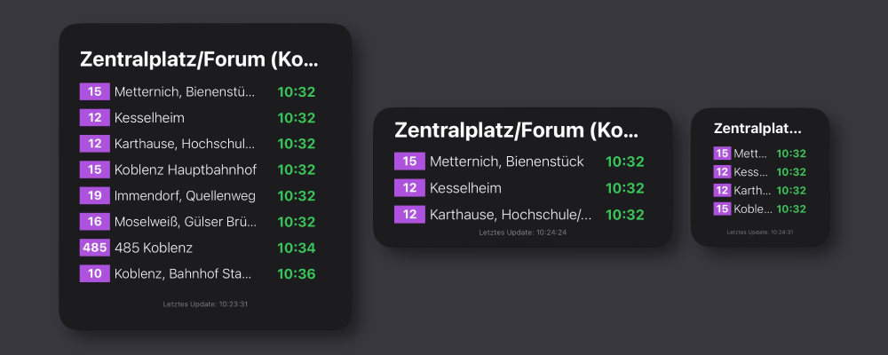

# koveb-scriptable-widget

A real-time public transport widget for the city of Koblenz (Germany), designed for iOS using [Scriptable](https://scriptable.app/).  
Displays the next departures for any koveb bus stop directly on your home screen.

---

## ✨ Features

- Real-time departure information from the Koblenz koveb system
- Fully supports **small**, **medium**, and **large** widget sizes
- Clean UI: colored bus line tags, destination text, time, delay indicator
- Auto-updates via ScriptDude

---

## 📲 Quick Install via ScriptDude

&docs=https%3A%2F%2Fgithub.com%2FElishaDev%2Fkoveb-scriptable-widget)

### Installation Instructions

1. Install [ScriptDude](https://scriptdu.de) on your iPhone or iPad.
2. Click the button above.
3. On the ScriptDude page, tap the blue **Install** button.
4. Scriptable will open and ask to add the widget script.
5. Now add a Scriptable widget to your Home Screen:
   - Tap and hold → Add Widget → Scriptable
   - Choose any size (small, medium, large)
   - Tap and hold the widget → Edit Widget
   - Select `koveb-scriptable-widget` as script
   - Enter a stop name (e.g. `Zentralplatz`) as parameter

---

## ⚠️ Notes

- This project is unofficial and not affiliated with koveb or the city of Koblenz.
- The script fetches public data from [liniennetz.koveb.de](https://liniennetz.koveb.de).

---

## 🙏 Credits

This project is inspired by the fantastic  
👉 [MVG-Abfahrtsmonitor by @eckertj](https://github.com/eckertj/MVG-Abfahrtsmonitor)

---

## 📄 License

Apache License
